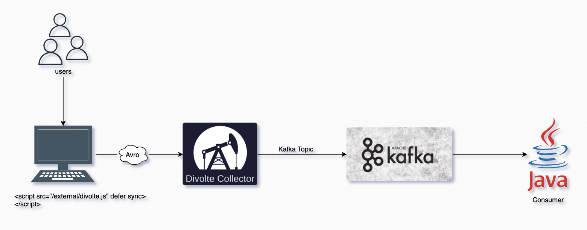

# divolte-collector-with-apache-kafka

A proof of concept about collecting clickstream data using Javascript, Divolte Collector, Apache Kafka and Java consumer application.

# Youtube video

[Divolte Collector with Apache Kafka](#)

# Architecture Diagram



# Technologies Used

* [Javascript](https://developer.mozilla.org/en-US/docs/Web/JavaScript)
* [Divolte Collector](https://divolte.io/)
* [Apahce Avro](https://avro.apache.org/)
* [Apache Kafka](https://kafka.apache.org/)
* [Java 8](https://www.oracle.com/java/technologies/javase/javase-jdk8-downloads.html)
* [Apache Maven](https://maven.apache.org/)


## Requirements

* Divolte Collector and Apache Kafka: require java 8+

## 1- Set up the website

1. Create a folder with bellow files:

* [index.html](/website/index.html), for geo-location information I have used this open source tool [geolocation-db](https://geolocation-db.com/)
* [main.js](/website/main.js)

## 2- Install Divolte Collector

1. Download divolte collector // you may check the latest version available in the official website.

```
wget http://divolte-releases.s3-website-eu-west-1.amazonaws.com/divolte-collector/0.9.0/distributions/divolte-collector-0.9.0.tar.gz
```

2. Unzip the tar file, and go inside the folder.

```
tar -xzf divolte-collector-*.tar.gz

cd divolte-collector-*
```

3. Create bellow files in /conf folder with related content:
* [divolte-collector.conf](/divolte-collector-0.9.0/conf/divolte-collector.conf)
* [MyEventRecord.avsc](/divolte-collector-0.9.0/conf/MyEventRecord.avsc)
* [mapping.groovy](/divolte-collector-0.9.0/conf/mapping.groovy)

4. Run Divolte collector server.

```
./bin/divolte-collector
```

## 3- Install Apache Kafka

1. Download Apache Kafka // you may check the latest version available in the official website.

```
wget https://downloads.apache.org/kafka/2.8.0/kafka_2.13-2.8.0.tgz
```

2. Unzip the tar file, and go inside the folder.

```
tar xzf kafka_*.tgz

cd kafka_*/
```

3. You can update config files if you wich, we are going to use the default values:
* [server.properties](/kafka_2.12-2.8.0/config/server.properties)
* [zookeeper.properties](/kafka_2.12-2.8.0/config/zookeeper.properties)

4. Run Zookeeper.

```
./bin/zookeeper-server-start.sh ./config/zookeeper.properties
```

5. Run Kafka cluster.

```
./bin/kafka-server-start.sh ./config/server.properties
```

6. You can create a Kafka topic named "tracking", but it is unnecessary because Divolte Collector is going to create it by default.

```
./bin/kafka-topics.sh --create --zookeeper localhost:2181 --replication-factor 1 --partitions 1 --topic tracking
```

7. You can create a Kafka consumer CLI for a quick check.

```
./bin/kafka-console-consumer.sh --bootstrap-server localhost:9092 --topic tracking
```

## 4- Run Java consumer

1. Downlaod the java project as subfolder from this repository using SVN.
```
svn checkout https://github.com/soufianeodf/youtube-divolte-collector-with-apache-kafka/trunk/kafka-consumer
```
2. Open project in your prefer text editor.
3. Update Maven to download all dependencies.
4. Run KafkaConsumerExample Class.

